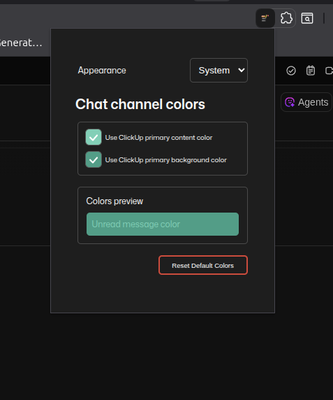
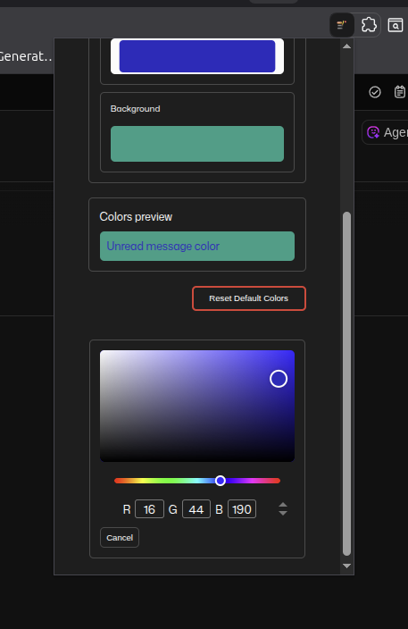
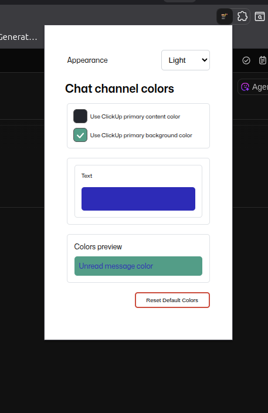

# ClickUp Chat Channel Color Extension

## Setup & Installation

1. **Clone the repository:**
   ```sh
   git clone https://github.com/DeDe-code/clickup-chat-color-chrome-extension.git
   cd clickup-chat-color-chrome-extension
   ```
2. **Install dependencies:**
   ```sh
   npm install
   ```
3. **Build the extension:**
   ```sh
   npm run build:ext
   ```
   This will generate the extension package in the `web-ext-artifacts/` folder.
4. **Load the extension in Chrome:**
   - Open Chrome and go to `chrome://extensions`
   - Enable "Developer mode" (top right)
   - Click "Load unpacked"
   - Select the `dist/` folder inside the project directory
   - The extension should now appear in your extensions list

## Usage Walkthrough

1. **Open ClickUp in your browser** (app.clickup.com)
2. **Click the extension icon** in the Chrome toolbar to open the popup
3. **Select your preferred theme** (light, dark, or system)
4. **Customize chat channel colors:**
   - Use the checkboxes to toggle between ClickUp default colors and custom colors
   - Click the color pickers to choose your own background and text colors for unread messages
   - Preview updates instantly in the popup
5. **Reset to defaults:**
   - Click the "Reset Default Colors" button to restore ClickUp's original theme colors
6. **Changes are applied instantly** to unread chat channels in ClickUp
7. **Accessibility:**
   - All controls are keyboard accessible
   - Focus rings and ARIA labels are provided for usability

---






## Overview

This Chrome extension enhances ClickUp by allowing users to customize chat channel colors for unread messages. It provides a modern, accessible UI for color selection, theme switching, and instant preview, making ClickUp more visually organized and user-friendly.

---

## Purpose & Goals

- **Purpose:**

  - Empower users to visually highlight unread messages in ClickUp chat channels.
  - Provide full control over text and background colors for improved accessibility and personal preference.
  - Support light, dark, and system themes for seamless integration with user environments.

- **Goals:**
  - Deliver a robust, maintainable, and secure Chrome extension using modern web technologies.
  - Ensure accessibility, usability, and a professional look suitable for portfolio and real-world use.

---

## What I Learned

- **Vue 3 & Composition API:** Modular component design, composables for logic reuse, and state management with Pinia.
- **Chrome Extension APIs:** Storage, messaging, and content script integration for persistent and dynamic UI changes.
- **Accessibility:** Focus management, visible focus rings, input-in-label patterns, and keyboard navigation.
- **Atomic Design:** Breaking UI into small, reusable components for maintainability and scalability.
- **MutationObserver:** Dynamic DOM manipulation for popup integration and cancel logic.
- **Testing & Debugging:** Iterative development, trn-system-oubleshooting build and runtime issues, and validating UX improvements.

---

## Architecture & Tech Stack

- **Vue 3** (Composition API)
- **Vite** (fast development/build)
- **Pinia** (state management)
- **Chrome Storage API** (persistent settings)
- **Custom CSS** (theme, accessibility, responsive design)
- **vue-color-input** (color picker component)
- **MutationObserver** (dynamic popup logic)
- **Content Script** (content.js for DOM updates)

---

## Project Structure

```
├── public/
│   ├── manifest.json
│   ├── icon.png, favicon.ico, ...
├── src/
│   ├── App.vue
│   ├── main.js
│   ├── assets/
│   │   ├── base.css, fonts.css, ...
│   ├── background/
│   │   └── background.js
│   ├── components/
│   │   ├── ColorManager.vue
│   │   ├── ColorPicker.vue
│   │   ├── Checkbox.vue
│   │   ├── ThemeSelector.vue
│   │   ├── ResetButton.vue
│   │   ├── ColorPreview.vue
│   │   ├── Footer.vue
│   ├── composables/
│   │   ├── useTheme.js
│   │   ├── useChromeStorage.js
│   │   ├── useContentScriptMessaging.js
│   │   ├── useMutationObserver.js
│   │   ├── useColorPicker.js
│   ├── content/
│   │   └── content.js
│   ├── router/
│   │   └── index.js
│   ├── stores/
│   │   └── ColorStore.js
│   ├── views/
│   │   └── UmcExtentionView.vue
├── build-utils/
│   ├── check-content-script.js
│   ├── copy-content-script.js
│   ├── post-build.js
├── package.json
├── README.md
```

---

## Component & Composable Details

### Components

- **ColorManager.vue**: Main UI for color selection, checkboxes, and color pickers. Integrates cancel logic and emits events for popup state.
- **ColorPicker.vue**: Atomic color picker using `vue-color-input`, emits open/close events, supports live preview and cancel.
- **Checkbox.vue**: Accessible, styled checkbox for toggling ClickUp theme colors.
- **ThemeSelector.vue**: Dropdown for switching between light, dark, and system themes.
- **ResetButton.vue**: Resets all colors and settings to ClickUp defaults.
- **ColorPreview.vue**: Live preview of unread message color based on current settings.
- **Footer.vue**: Portfolio footer, copyright.

### Composables

- **useTheme.js**: Manages theme switching and applies theme classes.
- **useChromeStorage.js**: Abstracts Chrome Storage API for persistent settings.
- **useContentScriptMessaging.js**: Sends messages to content script for live DOM updates.
- **useMutationObserver.js**: Handles dynamic DOM changes, especially for popup/cancel logic.
- **useColorPicker.js**: Manages color picker state, syncs with storage, supports reset.

### Content Script

- **content.js**: Injected into ClickUp, applies color styles to unread messages, listens for storage and popup changes, uses MutationObserver for robust DOM updates.

---

## Key NPM Commands

```sh
# Install dependencies
npm install

# Start development server
npm run dev

# Build and watch for changes (no browser)
npm run dev:ext

# Start dev with Chrome extension auto-reload
npm run dev:ext:browser

# Simple build (if content.js fails)
npm run dev:ext:simple

# Simple build with browser
npm run dev:ext:simple:browser

# Clean and rebuild everything
npm run dev:clean

# Build for production
npm run build

# Build extension package for distribution
npm run build:ext

# Lint code
npm run lint
```

---

## How It Works

1. **User opens extension popup**
2. **Selects theme and custom colors**
3. **ColorManager.vue** manages state, shows color pickers, and emits events
4. **ColorPicker.vue** allows live color selection, supports cancel/confirm
5. **Settings are saved to Chrome Storage and sent to content.js**
6. **content.js** applies styles to unread messages in ClickUp
7. **Preview updates instantly, theme and accessibility are preserved**

---
